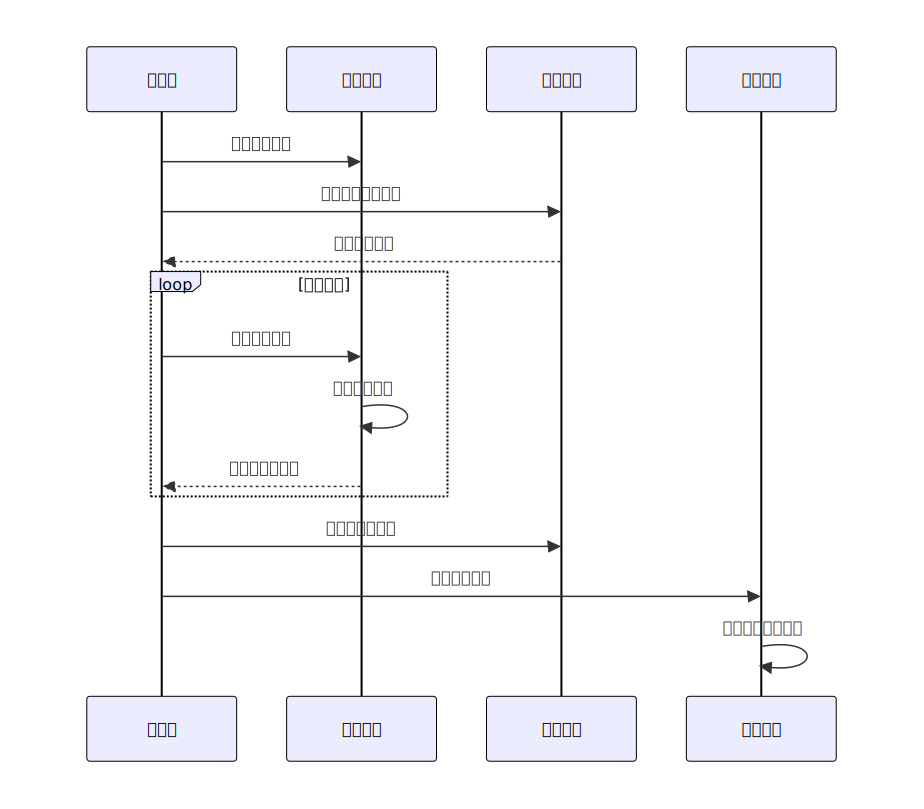

## 📋 **目录导航**

### [1. 项目概述](#1-项目概述)
- [1.1 项目简介](#11-项目简介)
- [1.2 主要特性](#12-主要特性)

### [2. 系统架构设计](#2-系统架构设计)
- [2.1 整体架构图](#21-整体架构图)
- [2.2 UML类图](#22-uml类图)
- [2.3 系统模块划分](#23-系统模块划分)

### [3. 详细设计说明](#3-详细设计说明)
- [3.1 游戏规则系统](#31-游戏规则系统)
- [3.2 多线程架构设计](#32-多线程架构设计)
- [3.3 渲染优化策略](#33-渲染优化策略)

### [4. 程序流程图](#4-程序流程图)
- [4.1 主程序活动图](#41-主程序活动图)
- [4.2 演化过程时序图](#42-演化过程时序图)

### [5. 使用说明](#5-使用说明)
- [5.1 系统要求](#51-系统要求)
- [5.2 安装步骤](#52-安装步骤)
- [5.3 界面说明](#53-界面说明)
- [5.4 规则语法说明](#54-规则语法说明)
- [5.5 快捷键](#55-快捷键)

### [6. 测试方案](#6-测试方案)
- [6.1 单元测试](#61-单元测试)
- [6.2 集成测试](#62-集成测试)

### [7. 设计亮点与创新](#7-设计亮点与创新)
- [7.1 技术亮点](#71-技术亮点)
- [7.2 创新功能](#72-创新功能)
- [7.3 扩展性设计](#73-扩展性设计)

### [8. 问题与解决方案](#8-问题与解决方案)
- [8.1 遇到的主要问题](#81-遇到的主要问题)
- [8.2 性能优化总结](#82-性能优化总结)

### [9. 未来改进方向](#9-未来改进方向)
- [9.1 功能扩展](#91-功能扩展)
- [9.2 技术改进](#92-技术改进)
- [9.3 用户体验](#93-用户体验)

### [10. 参考文献](#10-参考文献)

---

<h3>📁 <a href="#目录导航">返回目录</a></h3>

---

## 1. 项目概述

### 1.1 项目简介

本项目是一个基于C++和EasyX图形库实现的康威生命游戏（Conway's Game of Life）模拟器。生命游戏是一个经典的元胞自动机，展示了简单的规则如何产生复杂的演化行为。

### 1.2 主要特性

- **完整的图形界面**：基于EasyX的可视化窗口
- **可自定义规则**：支持B/S格式的自定义演化规则
- **多线程架构**：独立的输入线程处理用户交互
- **性能优化**：增量绘制、状态缓存等优化技术
- **完整的UI系统**：按钮、滑块、面板等控件

<h4><a href="#目录导航">⬆️ 返回目录</a></h4>

---

## 2. 系统架构设计

### 2.1 整体架构图

┌─────────────────────────────────────────────────────────┐  
│ 应用层 (Application Layer) │  
├─────────────────────────────────────────────────────────┤  
│ ┌──────────┐ ┌──────────┐ ┌──────────────┐ │  
│ │ 主循环 │ │ 输入线程 │ │ 渲染系统 │ │  
│ └──────────┘ └──────────┘ └──────────────┘ │  
├─────────────────────────────────────────────────────────┤  
│ 核心层 (Core Layer) │  
├─────────────────────────────────────────────────────────┤  
│ ┌──────────┐ ┌──────────┐ ┌──────────────┐ │  
│ │游戏规则类│ │ 地图管理 │ │ 演化引擎 │ │  
│ └──────────┘ └──────────┘ └──────────────┘ │  
├─────────────────────────────────────────────────────────┤  
│ UI层 (User Interface Layer) │  
├─────────────────────────────────────────────────────────┤  
│ ┌──────────┐ ┌──────────┐ ┌──────────────┐ │  
│ │ 按钮控件 │ │ 滑块控件 │ │ 面板控件 │ │  
│ └──────────┘ └──────────┘ └──────────────┘ │  
└─────────────────────────────────────────────────────────┘

text

### 2.2 UML类图

 
<small><em>图2.2：系统UML类图</em></small>

### 2.3 系统模块划分

#### 2.3.1 游戏核心模块

- **GameRules类**：管理演化规则
    
- **地图数据**：二维布尔数组表示细胞状态
    
- **演化引擎**：计算下一代细胞状态
    

#### 2.3.2 UI系统模块

- **控件基类**：UIComponent抽象基类
    
- **具体控件**：Button, Slider, Panel, Label
    
- **布局管理**：控制面板的组件组织
    

#### 2.3.3 线程管理模块

- **主线程**：游戏循环、渲染
    
- **输入线程**：鼠标输入处理
    

#### 2.3.4 渲染优化模块

- **增量绘制**：只重绘变化部分
    
- **双缓冲**：避免画面闪烁
    
- **状态缓存**：减少不必要的计算
    

 <h4><a href="#目录导航">⬆️ 返回目录</a></h4> 

---

## 3. 详细设计说明

### 3.1 游戏规则系统

#### 3.1.1 规则格式

游戏使用标准的B/S（出生/存活）规则表示法：

- **B3/S23**：经典康威生命游戏规则
    
    - B3：死细胞周围有3个活细胞时出生
        
    - S23：活细胞周围有2或3个活细胞时存活
        
- **自定义规则**：支持任意Bx/Sy格式
    

#### 3.1.2 规则解析算法

c++

bool GameRules::parseRulesFromString(const std::wstring& rulesStr) {
    // 1. 查找B和S的位置
    // 2. 提取出生条件数字
    // 3. 提取存活条件数字
    // 4. 验证并存储
}

### 3.2 多线程架构设计

#### 3.2.1 线程分工

text

主线程职责：
├── 消息循环处理
├── 游戏状态更新
├── UI渲染
└── 性能控制

输入线程职责：
├── 鼠标状态轮询
├── 地图编辑操作
└── 线程安全的数据访问

#### 3.2.2 同步机制

- **临界区（CRITICAL_SECTION）**：保护地图数据的读写
    
- **volatile标志**：线程间通信
    
- **Sleep控制**：平衡性能和响应
    

### 3.3 渲染优化策略

#### 3.3.1 增量绘制算法

c++

void drawMap(bool map[ROWS][COLS]) {
    // 1. 获取地图快照
    // 2. 与prevMap比较差异
    // 3. 只重绘变化的单元格
    // 4. 更新prevMap缓存
}

#### 3.3.2 UI脏标记机制

c++

// 只有UI状态变化时才重绘UI区域
if (uiDirty || firstDraw) {
    // 重绘所有UI组件
    uiDirty = false;
}

 <h4><a href="#目录导航">⬆️ 返回目录</a></h4> 

---

## 4. 程序流程图

### 4.1 主程序活动图

 
<small><em>图4.1：主程序活动流程图</em></small>

### 4.2 演化过程时序图

 
<small><em>图4.2：细胞演化过程时序图</em></small>

 <h4><a href="#目录导航">⬆️ 返回目录</a></h4> 

---

## 5. 使用说明

### 5.1 系统要求

- **操作系统**：Windows 7/8/10/11
    
- **开发环境**：Visual Studio（推荐2019或更高版本）
    
- **依赖库**：EasyX图形库
    

### 5.2 安装步骤

1. 安装Visual Studio开发环境
    
2. 下载并安装EasyX图形库
    
3. 克隆或下载项目源代码
    
4. 用Visual Studio打开项目文件
    
5. 编译并运行程序
    

### 5.3 界面说明

#### 5.3.1 主窗口布局

┌─────────────────────────────────────────────────┐
│ 细胞演化区                     │ 控制面板         │
│                                │                 │
│                                │ 生命游戏控制面板│
│                                │                 │
│                                │ [开始演化]      │
│                                │ [暂停]          │
│                                │ [重置]          │
│                                │ [规则设置]      │
│                                │ [隐藏网格]      │
│                                │                 │
│                                │ ───○───── 速度  │
│                                │ 代数: 0         │
│                                │ 模式: 设置中     │
│                                │ 种群: 0         │
└────────────────────────────────┴─────────────────┘
#### 5.3.2 操作方法

1. **设置模式**（初始状态）
    
    - 左键点击：放置活细胞
        
    - 右键点击：清除细胞
        
    - 在网格上拖动：连续编辑
        
2. **运行控制**
    
    - 点击"开始演化"：开始自动演化
        
    - 点击"暂停"：暂停演化
        
    - 点击"重置"：清空地图并回到设置模式
        
    - 拖动滑块：调整演化速度（1-20代/秒）
        
3. **规则设置**
    
    - 点击"规则设置"按钮
        
    - 输入B/S格式的规则（如"B3/S23"）
        
    - 支持自定义规则，如"B36/S23"
        

### 5.4 规则语法说明

#### 5.4.1 基本格式

B<出生条件>/S<存活条件>

- **B**：Birth（出生）条件
    
- **S**：Survive（存活）条件
    
- 数字表示邻居数量
    

#### 5.4.2 示例规则

|规则|描述|特点|
|---|---|---|
|B3/S23|经典康威生命游戏|产生复杂图案|
|B36/S23|高生命（HighLife）|出现复制器|
|B34/S34|34生命|稳定且生长快|
|B1357/S1357|复制生命|产生复杂结构|

### 5.5 快捷键（如果有）

- **空格键**：开始/暂停切换
    
- **R键**：重置地图
    
- **G键**：显示/隐藏网格
    
- **ESC键**：退出程序
    

 <h4><a href="#目录导航">⬆️ 返回目录</a></h4> 

---

## 6. 测试方案

### 6.1 单元测试

#### 6.1.1 游戏规则测试

c++

// 测试用例1：经典规则B3/S23
TEST(GameRulesTest, StandardRules) {
    GameRules rules;
    rules.setStandardRules();
    
    // 测试存活条件
    EXPECT_TRUE(rules.shouldSurvive(2, true));
    EXPECT_TRUE(rules.shouldSurvive(3, true));
    EXPECT_FALSE(rules.shouldSurvive(1, true));
    
    // 测试出生条件
    EXPECT_TRUE(rules.shouldBeBorn(3));
    EXPECT_FALSE(rules.shouldBeBorn(2));
}

#### 6.1.2 邻居计数测试

c++

TEST(NeighborTest, CountAliveNeighbors) {
    bool testMap[3][3] = {
        {1, 0, 1},
        {0, 1, 0},
        {1, 0, 1}
    };
    
    // 中心细胞(1,1)应有4个邻居
    int count = getRoundAlive(testMap, 1, 1);
    EXPECT_EQ(count, 4);
}

### 6.2 集成测试

#### 6.2.1 演化测试用例

|测试图案|预期行为|验证方法|
|---|---|---|
|静态方块|保持不变|演化10代后检查|
|闪烁灯|2代周期|检查周期一致性|
|滑翔机|4代周期移动|检查位置变化|
|随机初始|符合规则|抽样检查细胞状态|

#### 6.2.2 UI交互测试

1. **按钮功能测试**
    
    - 点击所有按钮，检查功能是否正常
        
    - 测试按钮状态切换（启用/禁用）
        
2. **滑块测试**
    
    - 拖动滑块，检查数值变化
        
    - 测试演化速度是否相应变化
        
3. **鼠标编辑测试**
    
    - 左键绘制，右键擦除
        
    - 拖动绘制连续细胞
        

 <h4><a href="#目录导航">⬆️ 返回目录</a></h4> 

---

## 7. 设计亮点与创新

### 7.1 技术亮点

1. **多线程架构**：输入与渲染分离，提高响应性
    
2. **增量渲染系统**：大幅提升渲染性能
    
3. **完整的UI框架**：可复用的UI组件系统
    
4. **灵活的游戏规则**：支持任意B/S规则
    

### 7.2 创新功能

1. **实时规则编辑**：运行时修改演化规则
    
2. **性能可视化**：UI脏标记系统
    
3. **线程安全设计**：临界区保护共享数据
    
4. **优化的用户交互**：平滑的鼠标绘制体验
    

### 7.3 扩展性设计

1. **模块化设计**：易于添加新功能
    
2. **插件式规则系统**：可扩展规则类型
    
3. **可配置的UI布局**：控件位置可调整
    
4. **多语言支持**：使用宽字符，支持中文
    

 <h4><a href="#目录导航">⬆️ 返回目录</a></h4> 

---

## 8. 问题与解决方案

### 8.1 遇到的主要问题

#### 8.1.1 线程同步问题

- **问题**：多线程访问共享地图数据导致竞争条件
    
- **解决方案**：使用临界区（CRITICAL_SECTION）保护数据访问
    

#### 8.1.2 渲染性能问题

- **问题**：每帧重绘整个网格导致卡顿
    
- **解决方案**：实现增量绘制系统，只重绘变化部分
    

#### 8.1.3 消息处理冲突

- **问题**：EasyX消息循环与输入线程冲突
    
- **解决方案**：分离鼠标输入处理到独立线程
    

### 8.2 性能优化总结

|优化阶段|技术手段|效果|
|---|---|---|
|第一阶段|双缓冲技术|消除画面闪烁|
|第二阶段|增量绘制|FPS从20提升到60+|
|第三阶段|UI脏标记|减少不必要的UI重绘|
|第四阶段|状态缓存|避免重复计算|

 <h4><a href="#目录导航">⬆️ 返回目录</a></h4> 

---

## 9. 未来改进方向

### 9.1 功能扩展

1. **更多预制图案**：常见生命游戏图案库
    
2. **演化历史**：撤销/重做功能
    
3. **性能统计**：详细的性能监控面板
    
4. **规则库**：保存和加载自定义规则
    

### 9.2 技术改进

1. **GPU加速**：使用Shader进行并行计算
    
2. **更大的地图**：支持滚动查看大尺寸地图
    
3. **网络功能**：多人协作编辑
    
4. **录制功能**：导出演化过程为视频
    

### 9.3 用户体验

1. **主题系统**：支持深色/浅色主题
    
2. **触摸支持**：优化触摸屏操作
    
3. **快捷键**：完整的键盘快捷键支持
    
4. **帮助系统**：内置教程和说明
    

 <h4><a href="#目录导航">⬆️ 返回目录</a></h4> 

---

## 10. 参考文献

1. Conway, J. H. (1970). "The Game of Life". Scientific American.
    
2. Gardner, M. (1970). "Mathematical Games". Scientific American.
    
3. EasyX图形库文档：[https://docs.easyx.cn/](https://docs.easyx.cn/)
    
4. Windows多线程编程指南
    

 <h4><a href="#目录导航">⬆️ 返回目录</a></h4> 

---

 <small>文档版本：1.0.0 | 最后更新：[2025.12.8]</small> 

